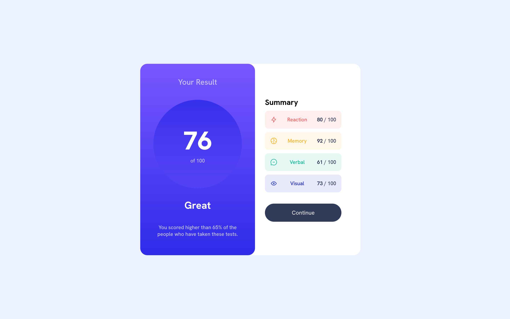
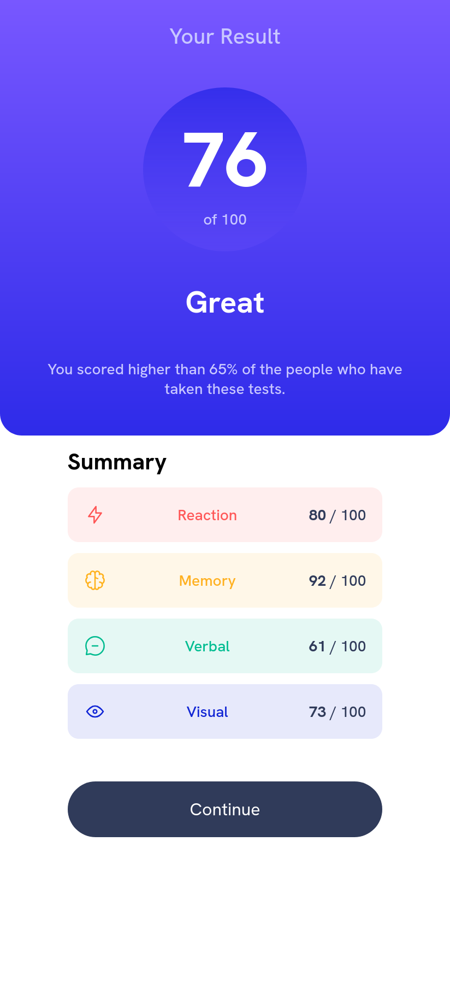

# Frontend Mentor - Results summary component solution

This is a solution to the [Results summary component challenge on Frontend Mentor](https://www.frontendmentor.io/challenges/results-summary-component-CE_K6s0maV). Frontend Mentor challenges help you improve your coding skills by building realistic projects. 

## Table of contents

- [Overview](#overview)
  - [Screenshot](#screenshot)
  - [Links](#links)
- [My process](#my-process)
  - [Built with](#built-with)
  - [What I learned](#what-i-learned)
- [Author](#author)

## Overview


### Screenshot

<p>Desktop View</p>

<p>Mobile View</p>


### Links

- Solution URL: [Solution URL here](https://github.com/abdullah09c/results-summary-component-main.git)
- Live Site URL: [Add live site URL here](https://your-live-site-url.com)

## My process

### Built with

- Semantic HTML5 markup
- CSS custom properties
- Flexbox
- CSS Grid

### What I learned

Through this project, I gained practical experience with CSS Grid and Flexbox. I learned how to use these layout techniques to create responsive web pages that adapt well to different screen sizes. Working on this challenge significantly improved my understanding and confidence in applying both CSS Grid and Flexbox effectively.

#### Code Examples from Project

The following examples demonstrate how I implemented CSS Grid and Flexbox in this project:

```css
/* Main layout structure using CSS Grid */
.container {
  display: grid;
  grid-template-columns: 1fr 1fr;
  grid-row: auto;
  grid-template-areas: "card1 card2";
  width: 45vw;
}
```
```css
.card1 {
  grid-area: card1;
  background: linear-gradient(hsl(252, 100%, 67%), hsl(241, 81%, 54%));
  color: hsl(0, 0%, 100%);
  border-radius: 20px;
  display: flex;
  flex-direction: column;
  align-items: center;
  justify-content: center;
  height: 60vh;
  text-align: center;
  z-index: 1;
}
```
```css
.card2 {
  grid-area: card2;
  display: flex;
  flex-direction: column;
  background: hsl(0, 0%, 100%);
  border-radius: 20px;
  position: relative;
  right: 8%;
  justify-content: center;
  align-items: center;
}
```


## Author

- Frontend Mentor - [@abdullah09c](https://www.frontendmentor.io/profile/abdullah09c)
- GitHub  - [@abdullah09c](https://www.github.com/abdullah09c)


